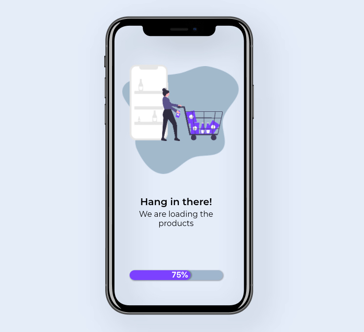

# Interaction Design

#### Hosted at: https://katwlodarczyk.github.io/interaction-design/

## Introduction

This repository is a set of reusable React components that offer design solutions to real-world problems.

## 1. Splash screen

---
### Research
The main purpose of a splash screen is to show user that the application, or a part of it, is loading. Providing such display is helpful, because it reassures the user, that the application is still working and doing something in the background. As Grigsby in Progressive web apps states, *"Immediate feedback—such as highlights, sounds, animations, and other responses to interaction— help users understand where they are, what they’re doing, and how they can interact with the app. Google’s Material Design also places an emphasis on providing feedback with every interaction."*

Rohit Bhargava, in his book "Non obvious : how to think different, curate ideas & predict the future." talks about the Canadian research on attention span. It turns out, that *"humans have a shorter attention span than goldfish."* This discovery is crucial, because using a splash screen is asking users to wait. Using a gamification concept (*"adding game mechanics to non-gaming scenarios"* [^1] ), the waiting experience can change from boring, to exciting.
Animated character performing a task and a progress bar, so known from a game environment, helps keeping users more engaged.  

---

### Evaluation of guidelines

#### Colour 
The colour palette chosen for this component is kept within the main principles of Material Design guidelines: consistency, distinction and intention. 

Primary colour (#6C63FF) have been used for animated objects, such as products and a progress bar, to gain users attention.
Secondary colour (#D1D9E4) have been used as a background. Additionaly, dark secondary colour variant (#A5B9CB) is used as a background blob for the animation, to create a sense of belonging.
White (#FFFFFF) and black (#000000) have been chosen for typography. For good contrast, white is used on dark backgrounds, and black on light backgrounds.

### Motion 

As stated previously, motion can provide feedback. A good transition choreography, a sequence in which elements move, helps users understand what is happening and what has changed. 
Using the animation of a person filling the shopping cart with one product at a time, an showing how many products have left on the shelf, user can evaluate how long he has to wait. 

Additionaly, a progress bar at the bottom adds a bit more reasurance. 

---
### Planning and design prototyping
The idea for presented splash screen was to, in elegant and modent way, show the user how long it will take for the application to load.
A subtle animation of a person filling their shopping cart with products of the shelf, and additional loading bar changing colour and displayed percentage number, are a clear and communicative form of feedback.
The animation may also play a role of an entertainment while the user waits.

The creation of the design began from creating an animation. 
An illustration from Undraw.co have been imported to Figma, and separate frames have been created by changing the colour and position of elements. Then, using TinyImage plugin, frames have been merged to create a gif animation. 

After that, an iPhone X frame has been selected and a prototype design created using chosen colour palette. 

[See Figma file](https://www.figma.com/file/1N3XzTEanRil1uvJlh741f/shopping-cart-gif?node-id=28%3A0)

---
### Coding:

---
### Screencast

---

### Reflection

The created component is solving real-world problem of notifying user about the change/work in the background and keepeing him engaged while waiting. Common industry standards and principles have been identified and used. Research have provided necessary insights of human attention span and gamification concept.

---

[^1] PANNAFINO, J., 2012. *Interdisciplinary interaction design*. United States: Assiduous Publishing. p.45

--- 

## 2. Toggle Switch
